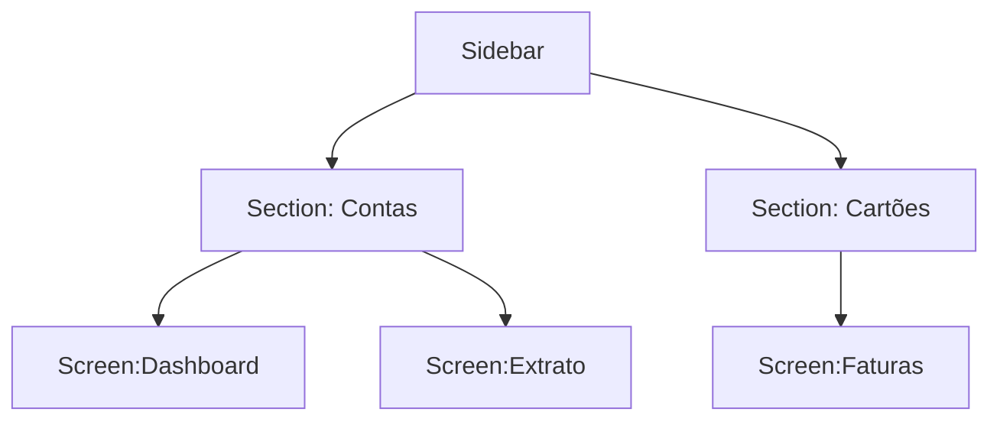
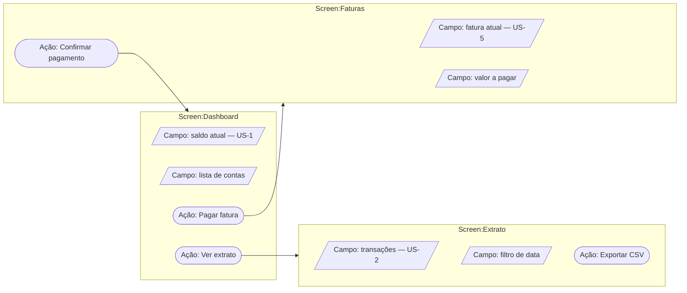
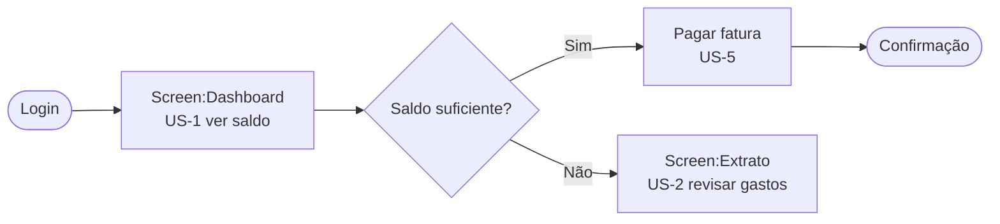
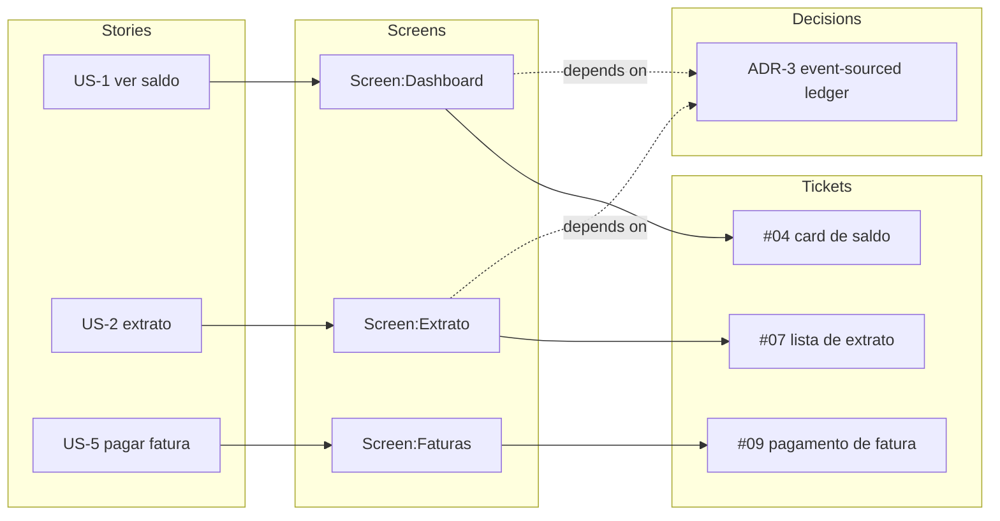
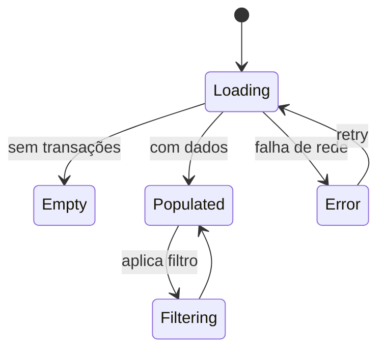
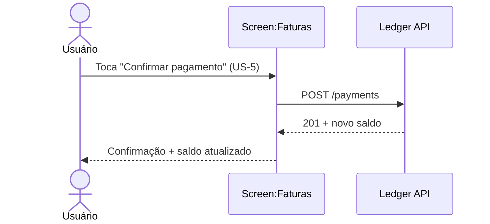
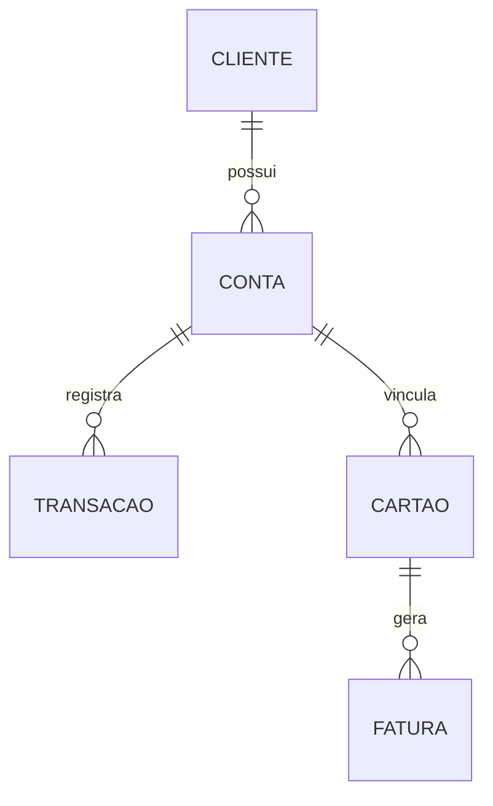
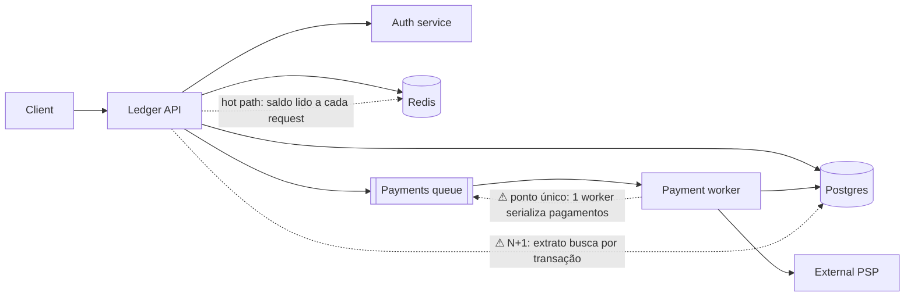

# The blueprint diagrams

Nine diagram types. The first five are the **connective backbone** — always drawn. The last four are **per-flow** — drawn when the flow's complexity earns them. Every diagram reuses the stable IDs from `SKILL.md` (`US-<n>`, `ADR-<n>`, `#<n>`, `Screen:<Name>`) so they cross-reference instead of standing alone.

All examples use one running example — a mobile bank — so the IDs line up across diagrams. Copy the skeletons; swap in the real IDs.

---

## 1. Screen inventory — the backbone

**Answers:** what screens exist, what each does, and which user stories it serves. **Always.** Build this first; every other diagram hangs off it.

A markdown table, not a diagram — it's the index the diagrams reference.

```md
| Screen            | Features                                  | Serves      |
| ----------------- | ----------------------------------------- | ----------- |
| Screen:Dashboard  | Account balance card, quick actions       | US-1, US-4  |
| Screen:Extrato    | Transaction list, filter by date, export  | US-2, US-3  |
| Screen:Faturas    | Card invoices, pay invoice                | US-5        |
```

---

## 2. Navigation map — the menus

**Answers:** how a user gets around — sidebar, sections, submenus, each screen. The app's information architecture, at a glance. **Always.**



Keep node labels as `Screen:<Name>` for screens so they match the inventory and the traceability map.

---

## 3. Screen detail map / wireflow — fields, actions, and where they lead ⭐

**Answers:** for each screen, *what fields it shows* and *what actions it offers*, with every action linked to the screen it leads to. **Always.** This is the diagram to review field-by-field: "does this screen need another field?", "what does this button do and where does it go?" — the level of detail where scope gaps surface before any code.

This is a **wireflow** in Mermaid — a wireframe's content joined to the user flow. It's the "mind map of each screen", but with real cross-links between screens, which a plain `mindmap` can't express. It carries the wireflow's *content and flow* (fields, actions, and where each action leads); the actual screen *layout* — where each field and button physically sits — is what [mockup](../mockup/SKILL.md) renders, so the blueprint doesn't redraw it low-fi here.

It's a `flowchart` with **one subgraph per screen**. Inside each: fields as parallelograms `[/ /]`, actions as stadiums `([ ])`. Actions draw edges out to the **target screen's subgraph**, so navigation and behaviour show together.



Tag fields with the `US-<n>` they realise where it's meaningful. For a big app, draw **one detail map per section** (or per wave) rather than one giant graph — the point is a screen you can read, not a wall.

---

## 4. User flow — the journey

**Answers:** the step-by-step path through the flow, including decision points. **Always.** Tag steps with the `US-<n>` they realise.



Use decision diamonds (`{ }`) for branches — that's the value over a flat list. If the flow forks by actor (customer vs admin), draw one flow per actor rather than tangling them.

Where the *screen detail map* (#3) shows fields and actions statically, the user flow shows the **order** those actions fire in — the two are complementary zoom levels on the same screens.

---

## 5. Traceability map — the connective tissue ⭐

**Answers:** why each screen exists and where each story becomes code — **user story → screen → decision (ADR) → ticket**. **Always.** This is the diagram the whole skill exists for; it must connect real IDs on every edge.



Every screen traces **back** to at least one story and **forward** to at least one ticket. A node with no edge is a finding — a story with no screen, or a screen no ticket builds — and goes back to the owning skill, not quietly deleted. If tickets aren't sliced yet, leave the `Tickets` subgraph empty with `%% tickets pending /to-tickets` and fill it later.

---

## 6. Screen states — how a screen behaves

**Answers:** the states a screen or entity moves through — loading, empty, error, populated. **Per-flow**, when a screen has non-trivial states. Mirrors the states [mockup](../mockup/SKILL.md) mocks (happy, empty, loading, error).



---

## 7. Sequence — who talks to whom, in time

**Answers:** the runtime interaction for a key action — user → UI → backend → response. **Per-flow**, for a critical or non-obvious path. Ties the flow to the **seams** `to-spec` named.



Name the UI participant `Screen:<Name>` so it ties back to the inventory and the detail map.

---

## 8. Data (ER) — entities and relationships

**Answers:** the domain entities and how they relate. **Per-flow / when the data model matters.** The bridge to `CONTEXT.md` and the domain ADRs — use the glossary's exact terms.



Keep entity names identical to the `CONTEXT.md` glossary — if the glossary says `Conta`, don't draw `Account`. A mismatch here is a domain-language drift worth flagging to [domain-modeling](../domain-modeling/SKILL.md).

---

## 9. System design — components, data flow, and bottlenecks

**Answers:** how the system is put together at runtime — client, API, services, data stores, queues, external dependencies — and *where the bottlenecks are*. **Per-flow / when the system has integration or scale surface.** A macro architecture view to spot risk *before* building, not after.

It's a `flowchart` of the topology with the **bottleneck candidates called out** (a flagged edge or `%%` note): hot paths, N+1 access, synchronous coupling, single points of failure, unbounded fan-out.



Flag each bottleneck with *why* it's a risk and, where known, the mitigation (cache, batch, async, replica). Keep service and store names aligned with the domain glossary and the ER diagram (#8), so the runtime view and the data view describe the same system.
